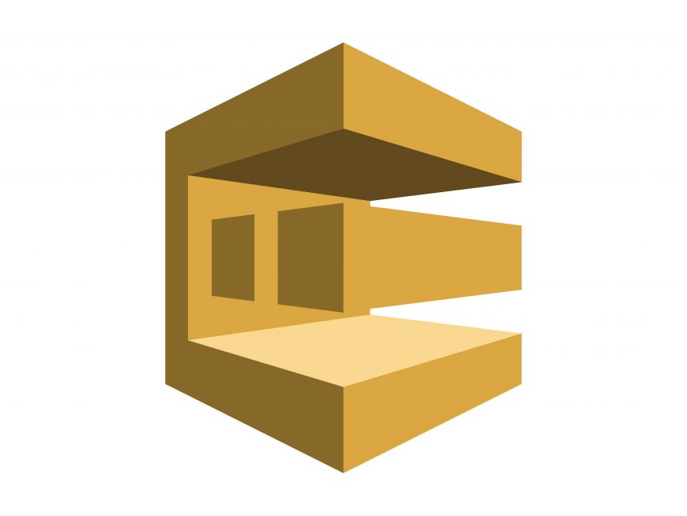

# AWS SQS Terraform PoC

This project is designed to set up AWS SQS (Simple Queue Service) queues using Terraform. It includes creating both a main queue and a dead-letter queue for handling messages that fail to process successfully.

## How It Works

- **Main Queue**: This is the primary queue where messages are sent. It includes configurations like delay time, message size, and retention period.

- **Dead-Letter Queue**: Messages that can't be processed after a certain number of attempts are sent to this queue. This helps to ensure that problematic messages are isolated for further analysis.

- **Redrive Policy**: The main queue is configured with a redrive policy that automatically redirects failed messages to the dead-letter queue after a specified number of processing attempts.

## What It Does

1. **Creates a Dead-Letter Queue**: The dead-letter queue is used to capture messages that fail to process multiple times in the main queue.

2. **Creates a Main Queue**: The main queue is set up with specific settings such as delay time, maximum message size, and retention period.

3. **Configures a Redrive Policy**: The main queue's redrive policy ensures that messages that can't be processed after four attempts are moved to the dead-letter queue.

## Usage

- **Terraform Init**: Initialize the project by downloading necessary Terraform providers.
  
- **Terraform Apply**: Apply the configuration to create the SQS queues in AWS.

- **Terraform Destroy**: Destroy the resources when they're no longer needed.

## Tags

The project tags the main queue with an environment tag to specify that it's for development purposes.

## License

This project is available under the MIT License.
